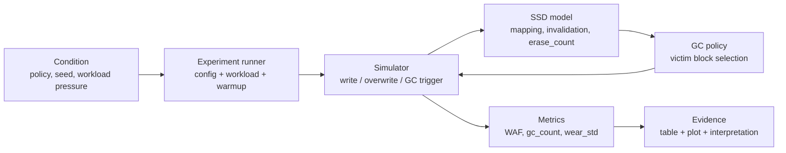
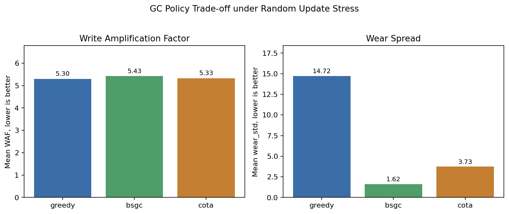

# GC Policy Validation Evidence

This note is a compact portfolio artifact for explaining the SSD GC validation flow:

```text
test condition -> experiment execution -> WAF / wear result -> engineering interpretation
```

It is intentionally small.  The goal is not to show many plots, but to show that the project can define a condition, run it reproducibly, collect meaningful metrics, and explain the trade-off.

## 1. Validation Question

The experiment asks:

> Under update-heavy SSD pressure, how do different GC victim-selection policies trade write amplification against wear balance?

Two metrics are used:

- `WAF`: write amplification factor. Lower is better because fewer internal device writes are needed per host write.
- `wear_std`: standard deviation of block erase counts. Lower is better because erase wear is more evenly distributed across blocks.

## 2. Test Condition

The workload is designed to force GC activity instead of measuring an almost-empty SSD.

| Field | Value |
|---|---:|
| Policies | `greedy`, `bsgc`, `cota` |
| Seeds | `41`, `42`, `43` |
| Host operations | `20,000` |
| Blocks | `64` |
| Pages per block | `32` |
| User capacity ratio | `0.95` |
| GC free block threshold | `0.12` |
| Update ratio | `0.90` |
| Hot data ratio | `0.20` |
| Hot data weight | `0.80` |
| Warmup fill | `0.70` |

Why this condition matters:

- `user_capacity_ratio=0.95` leaves limited spare area, so GC pressure appears quickly.
- `warmup_fill=0.70` avoids an unrealistically empty-device run.
- `update_ratio=0.90` creates many invalid pages through overwrites.
- Three seeds are used to avoid presenting a single lucky run.

## 3. Execution

The evidence run was produced with:

```powershell
python experiments.py `
  --ops 20000 `
  --blocks 64 `
  --pages_per_block 32 `
  --gc_free_block_threshold 0.12 `
  --user_capacity_ratio 0.95 `
  --update_ratio 0.9 `
  --hot_ratio 0.2 `
  --hot_weight 0.8 `
  --warmup_fill 0.7 `
  --grid "gc_policy=greedy,bsgc,cota; seed=41,42,43" `
  --out_dir results/portfolio_evidence_20260616 `
  --out_csv results/portfolio_evidence_20260616/summary.csv `
  --qc warn
```

The runner performs:



## 4. Result Summary

Average over three seeds:

| Policy | Mean WAF | WAF Range | Mean wear_std | wear_std Range | Mean GC Count |
|---|---:|---:|---:|---:|---:|
| `greedy` | `5.299` | `4.334 - 6.240` | `14.718` | `12.995 - 16.397` | `3488.0` |
| `bsgc` | `5.426` | `4.446 - 6.355` | `1.621` | `1.484 - 1.752` | `3597.7` |
| `cota` | `5.328` | `4.364 - 6.264` | `3.733` | `3.129 - 4.492` | `3524.0` |



The generated summary table is also saved as:

```text
docs/assets/portfolio_gc_policy_summary.csv
```

## 5. Interpretation

`greedy` gives the lowest mean WAF in this run, but it has the worst wear spread.

This matches the intuition of a pure greedy victim selector: it aggressively chooses blocks with the most invalid pages, which is good for immediate GC efficiency, but it does not actively smooth erase counts across blocks.

`bsgc` gives the best wear balance.  Its mean `wear_std` is much lower than `greedy`, but its WAF is slightly higher.

This is the expected cost of adding wear-leveling pressure: the policy may sometimes pick a block that is not the absolute best immediate reclaim target, because it also cares about erase distribution.

`cota` lands between the two.  It keeps WAF close to `greedy` while reducing wear spread substantially.

In this specific condition, COTA does not beat greedy on raw WAF and does not beat BSGC on wear balance.  Its value is as a compromise policy: it combines reclaim efficiency, coldness, age, and wear into one victim score.

## 6. Portfolio Takeaway

This experiment demonstrates a validation-engineering workflow rather than just an algorithm claim:

1. Define a stressful condition that exercises GC.
2. Run multiple policies under the same workload and seed set.
3. Collect reproducible metrics.
4. Compare performance and wear trade-offs.
5. Explain the limitation instead of claiming one policy always wins.

The key interview message:

> I modeled SSD GC behavior, created repeatable stress conditions, measured WAF and wear distribution, and used the results to explain the trade-off between immediate reclaim efficiency and long-term wear balance.

## 7. Limitations

This is a simplified simulator, not a physical SSD measurement.

- Wear is modeled as `erase_count`, not as NAND health telemetry.
- Latency, channel parallelism, read disturb, firmware scheduling, and real FTL details are abstracted away.
- The result supports policy comparison inside this model, not a claim about production SSD firmware performance.

Those limitations are intentional for a portfolio project: the focus is controlled validation logic, reproducibility, metric interpretation, and test automation.
